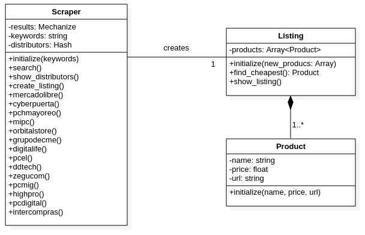

# Web scraper for PC Hardware prices

> This is a simple web scraper to search for the best price of PC Hardware parts on websites that sell and ship to México.

It works by searching for specific keywords of PC Hardware on the biggest México's websites. Then, it will show the best matches with the lowest prices available.

- MercadoLibre.com.mx
- Cyberpuerta.mx
- PCHMayoreo.com
- MiPC.com.mx
- Orbitalstore.mx
- Grupodecme.com
- Dimercom.mx
- Digitalife.com.mx
- PCel.com
- DDTech.mx
- Zegucom.com.mx
- PCMig.com.mx
- HighPro.com.mx
- PCDigital.com.mx
- Intercompras.com

## UML

## 🔧 Built With

- Ruby
- Gitflow workflow
- [Mechanize](https://github.com/sparklemotion/mechanize) 	* Includes Nokogiri as dependency
- [RSpec](https://rspec.info/)

## 🔴 Live Demo

## 🛠  Getting Started

To get a local copy up and running follow these simple example steps.
### Prerequisites
### Setup
### Install
### Usage
### Run tests
### Deployment

## ✒️ Author

👤 **Marcos Hernández Campos**

- Github: [@marcoshdezcam](https://github.com/marcoshdezcam)
- Twitter: [@MarcosHCampos](https://twitter.com/MarcosHCampos)
- Linkedin: [Marcos Hernández](https://linkedin.com/marcos-hernández-56058119a/)

## 🤝 Contributing

Contributions, issues and feature requests are welcome!

Feel free to check the [issues page](issues/).

## Show your support

Give a ⭐️ if you like this project!

## Acknowledgments

- Hat tip to anyone whose code was used
- Inspiration
- etc

## 📝 License

This project is [MIT](lic.url) licensed.
