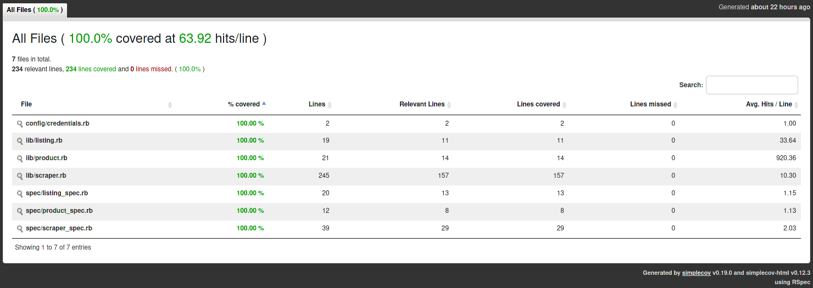

# Web scraper for PC Hardware prices

> This is a simple web scraper to search for the best price of PC Hardware parts on websites that sell and ship to México.

It works by searching for specific keywords of PC Hardware on the biggest México's websites. Then, it will show the best matches with the lowest prices available.
Mechanize with Nokogiri as dependency was used to fill search forms. And, Selenium to scrape websites (like Amazon) that require a real browser to visit their shop.

This is the list of distributors: 

	- MercadoLibre.com.mx
	- Cyberpuerta.mx
	- MiPC.com.mx
	- Orbitalstore.mx
	- Grupodecme.com
	- Dimercom.mx
	- Digitalife.com.mx
	- PCel.com
	- Zegucom.com.mx
	- PCMig.com.mx
	- HighPro.com.mx
	- PCDigital.com.mx
	- Intercompras.com

## 🔧 Built With

- Ruby
- Gitflow workflow
- [Mechanize](https://github.com/sparklemotion/mechanize) 	* Includes Nokogiri as dependency
- [RSpec](https://rspec.info/)
- [Selenium Webdriver](https://github.com/SeleniumHQ/selenium/tree/trunk/rb)
- [Simplecov](https://github.com/simplecov-ruby/simplecov)

## UML

## 🛠  Getting Started

To get a local copy up and running follow these simple example steps.

### Prerequisites
Depending on your distribution and, therefore your package manager, this commands may change. Here, Ubuntu is used as an example. 

- Ruby 2.7.x

##### ChromeDriver (required by Selenium WebDriver)
		 
	sudo apt-get install chromium-chromedriver

##### Install dependencies required by Mechanize
		
	sudo apt install build-essential

### Setup

#### Clone Github repository

	git clone https://github.com/marcoshdezcam/Ruby_WebScraper.git

#### Install required gems for this project
After cloning the repository, go to the directory where you downloaded it and run: 

	bundle install

### How to start

To run a search on all distributors just run the next command: 

	ruby ./bin/main.rb

### Tests 

To run the tests just use the following command:

	rspec

#### Test coverage report:

## ✒️ Author

👤 **Marcos Hernández Campos**

- Github: [@marcoshdezcam](https://github.com/marcoshdezcam)
- Twitter: [@MarcosHCampos](https://twitter.com/MarcosHCampos)
- Linkedin: [Marcos Hernández](https://linkedin.com/marcos-hernández-56058119a/)

## 🤝 Contributing

Contributions, issues and feature requests are welcome!

Feel free to check the [issues page](issues/).

## Show your support

Give a ⭐️ if you like this project!

## Acknowledgments

- Hat tip to anyone whose code was used
- Inspiration
- etc

## 📝 License

This project is [MIT](lic.url) licensed.
